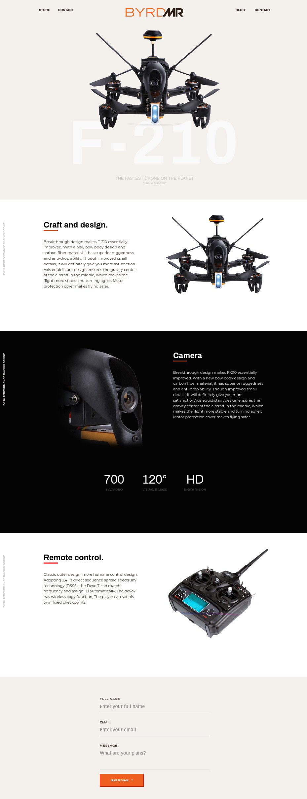

<p align="center">  </p>

<p align="center"> The Bryrd Drone Promo Website</p>

<!-- TABLE OF CONTENTS -->
## Table of Contents

* [About the Project](#about-the-project)
  * [Screenshots](#screenshots)
* [Getting Started](#getting-started)
    * [Software Requirements](#requirements)
* [Development Setup](#development-setup-linuxmac-os)
  * [Development Setup](#Development-setup)
  * [Application Struture](#application-structure)
  * [Firebase](#google-firebase)
* [Build & Deployment](#build-and-deploy)
* [License](#license)

## About the Project

<p>
Bryrd is a promotional website site for the Bryrd Drone. It showcases the features of the Bryrd drone product and collects inquires from users via a web form at the footer of the site. The site is fully responsive and comes with a built in contact form for collection user inquires. Data from the form is saved to the cloud using Google Firebase - specifically, Google's Realtime database. The application is built using Html, Sass & Vanilla Javascript and built using Nodejs and npm scripts. 
</p>

### Screenshosts
 

## Getting Started
### Software Requirements

The following programs are required to run this application:
- Nodejs V14.15.4+    ----------------- For live reloading and automated builds
- Npm V7.6.1+         ------------------------Managing external dependencies 
- Sass                 -----------------------------------Styling the website, it's compiled to css by a sass to css compiler
- Google Firebase -------------------For storing user contact information as a json datastore
- Git & Github  -------------------------Version control & hosting

## Development Setup (Linux/Mac Os)
### Development Setup (Linux/Mac Os)

It is assumed you are using a linux style operating system. This could be linux or Mac Os. 
A basic understanding of linux and the command line is assumed.

#### Download a local copy of the Repository
To get a copy of the project, you'll need [Git](https://git-scm.com). Please use the either of the commands below to get a local copy.

```bash
# Clone this repository
$ git clone git@github.com:ovieu/byrdmr-app.git 
or
$ git clone https://github.com/ovieu/byrdmr-app.git 

# 2. Move into the downloaded repository.
$ cd byrdmr-app 

# 3. Install dependencies using npm  
$ npm install #this installs the required dependencies using the package.json file in the project direcorty 

# 4. Run the app in development mode 
$ npm run start

# 5. Open a web browser (Chrome or Firefox) and View the live local demo by typing the following address into the browser:
localhost:8080
```
### Application structure
```bash
├── assets
├── css
├── favicon.ico
├── index.html
├── main.js
├── node_modules
├── package.json
├── package-lock.json
├── Readme.md
└── sass
    ├── abstracts
    │    ├── _functions.scss
    │    ├── _mixins.scss
    │    └── _variables.scss
    ├── base
    │    ├── _reset.scss
    │    ├── _typography.scss
    │    └── _utilities.scss
    ├── components
    │    ├── _alert.scss
    |    ├── _button.scss
    │    ├── _data.scss
    │    ├── _features.scss
    │    ├── _form.scss
    │    └── _nav.scss
    ├── layout
    │    └── _header.scss
    ├── main.scss
    ├── pages
    │   └── _index.scss
    ├── themes
    └── vendors
```
The index.html contains the view of the site. The sass folder contains all the css used in the project. The abstracts directory contains the function, mixins and variables partials. These are standalone styles that can be independently added to any component or Html element.

The base directory contains the resets, typography and utilities partials. Reset, resets all elements to universally acceptable defaults while typograhy and utilities are for type based styles and resusable styles.

The component directory contains elements that are unique, reusable and can be considered as a standalone element in HTML. 

The key to making this work is the main.scss file. It imports all styles from the above partials. It is this file that is expanded, compressed and minified into the final css file powering the entire site.

### Google Firebase
Please use the following instructions to setup your firebase database - [Firebase Database Setup](https://www.youtube.com/watch?v=PP4Tr0l08NE)

### Build and Deploy
To build the site for production/deployment, run the following command:
```bazaar
$   npm run build:production
```
This would build the entire site and store the output in a directory called "dist". This directory can be manually uploaded to a webhost or deployed as part of an automated process to get the site up and running in a live environment.

There are multiple options for deployment and hosting - AWS, DigitalOcean, Netlify etc. You can use this a guide to deploy via [Netlify](https://www.netlify.com/blog/2016/10/27/a-step-by-step-guide-deploying-a-static-site-or-single-page-app/). There are many tutorials and guides only showing detailed instructions on how to deploy easily. You can find them using a search engine.

## License
This software is released under the [MIT License](http://www.opensource.org/licenses/MIT).